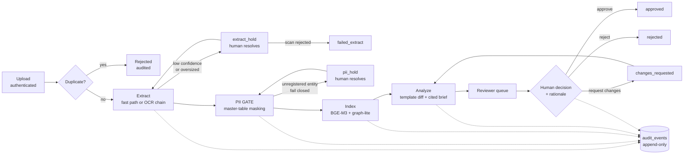

# AI Contract Review Co-Pilot

An AI-assisted workflow that helps in-house legal reviewers navigate, verify,
and approve/reject contracts — cutting review cycle time without ever taking
the decision out of human hands.

This repository is a **POC built for a C-level demo**: working functionality
first, architected for scale (10K → millions of documents) and shaped 1:1 to
an AWS production topology.

> **Synthetic data only.** The evaluation corpus is generated fake contracts
> with planted fake PII. No real contract text or real PII belongs in this
> repo or in any demo environment.

---

## Status

**All SDLC phases complete — gates G0–G7 passed** (reports in `docs/gates/`).

Measured on our own stack (sources in the gate reports):

| Metric | Value | Gate |
|---|---|---|
| Extraction fidelity — born-digital / scanned | 1.000 / 0.923 | G2 |
| PII recall in downstream text | 1.0000 (0 of 115 leaked) | G3 |
| Novel-PII documents halted (fail-closed) | 6/6 | G3 |
| Hybrid retrieval recall@10 | 1.000 (16 queries) | G4 |
| Known-issue detection | 0.923 (12/13) | G5 |
| Uncited AI findings shown to reviewers | 0 (by construction) | G5 |
| AI analysis latency (max) | 6.9 s in-container | G5/G7 |
| Auto-approvals in the audit trail | 0 (SQL-provable) | G6 |

Two presenter items remain before the session (not system defects): scale the
demo corpus to ~100 documents, and run two cold-start rehearsals of
`docs/demo_script.md`.

---

## Quick start

```bash
docker compose up -d --build          # Postgres+pgvector, MinIO, Presidio, API, worker
```

| Service | URL |
|---|---|
| API + React UI | http://localhost:8000 |
| API docs | http://localhost:8000/docs |
| MinIO console | http://localhost:9001 |
| Postgres | `localhost:5433` (5432 is left to a local Homebrew Postgres) |

Migrations run automatically on backend boot. Then seed accounts:

```bash
cd backend && uv run python -m backend.seed_users     # reviewer1, reviewer2, admin1
uv run python -m backend.seed_demo                    # optional demo corpus
```

Log in at http://localhost:8000, upload contracts, and watch them move through
the pipeline. The full walkthrough is `docs/demo_script.md`.

### Working on the code

```bash
# backend/
uv sync                                   # add --extra ml for embeddings, --extra ocr for fallback engines
uv run ruff check .
uv run pytest -q                          # unit tests
CRS_RUN_INVARIANT_TESTS=1 uv run pytest -m invariant   # needs compose Postgres up
uv run alembic upgrade head

# frontend/
npm install && npm run dev                # Vite dev server
npm run build
```

---

## Pipeline

```
upload → dedup/registry → extract → PII gate → index → analyze → human review
```



Everything left of the PII gate is raw-zone; everything right of it reads the
masked store only. **Full diagrams** — batched OCR chain, status state machine,
and deployment topology — are in [`docs/pipeline_flow.md`](docs/pipeline_flow.md).

| Stage | What happens |
|---|---|
| **Ingest** | Authenticated multi-file upload; content-hash dedup; document registry; job enqueued |
| **Extract** | Born-digital fast path; scanned PDFs go through the confidence-gated OCR chain (below) → clause segmentation |
| **PII gate** | Deterministic masking from the PII master table (fuzzy/OCR-tolerant); Presidio runs as a detector-only tripwire |
| **Index** | BGE-M3 embeddings, hybrid (vector + lexical) retrieval, Postgres graph-lite relations |
| **Analyze** | Template diff against canonical templates → STRONG model writes a brief over the deviations only (citations mandatory, ungrounded findings dropped); FAST model extracts key terms; prompt-injection heuristics |
| **Review** | Reviewer claims a contract and records a decision with a rationale |

Document statuses: `ingested → extracted → masked → indexed → analyzed →
in_review → approved | rejected | changes_requested`, plus the fail-closed
sidings `extract_hold`, `pii_hold`, `failed_extract`.

### OCR: confidence-gated engine chain

Scanned pages run through `CRS_OCR_ENGINE_CHAIN` (default
`tesseract,paddleocr,easyocr,docling`) behind one adapter interface
`ocr(page_image) → (text, confidence)`. A page scoring below
`CRS_OCR_CONFIDENCE_THRESHOLD` (0.80) is retried on the **next engine, that
page only**; the highest-confidence result wins. If every engine falls short,
the document parks in **`extract_hold`** — a human either accepts the
best-effort text with a rationale or rejects the scan. Every attempt is
audited; confidence is never fabricated.

Heavy engines live in the optional `ocr` extra; the default image ships
Tesseract only and the other adapters lazy-import, skipping with an audit
event when absent.

### Large documents

OCR runs in bounded batches of `CRS_OCR_BATCH_SIZE` (default 16) pages, so peak
memory is one batch rather than the whole document. Each completed batch is
checkpointed to the raw zone, letting a crashed job resume mid-document instead
of re-OCR'ing from page 1. Documents over `CRS_EXTRACT_MAX_PAGES` (default
1000) park in `extract_hold` with reason `oversized` for a human to route.

---

## Non-negotiable invariants

These are enforced in code and covered by `backend/tests/invariants/`:

1. **The PII gate is absolute.** Embedding, indexing, and the LLM read only the
   masked store. Raw text is never wired past the gate.
2. **Zero auto-approvals.** No code path transitions a contract to
   approved/rejected except the authenticated human-decision API, which
   requires a rationale. A failing pipeline job can never overwrite a terminal
   human decision.
3. **Everything is audited.** Every stage transition, AI suggestion, and human
   action appends to the append-only `audit_events` table. UPDATE/DELETE are
   never granted on it.
4. **No assumptions.** Deviations from the design document go to the product
   owner with evidence, and the outcome is recorded in the Decision Log in
   `CLAUDE.md`.

---

## API surface

| Route | Purpose |
|---|---|
| `POST /auth/login` | JWT issue (roles: reviewer, admin; Cognito-shaped seam in `auth.py`) |
| `POST /ingest/upload` | Authenticated multi-file upload |
| `GET /extract/holds` · `POST /extract/holds/{id}/resolve` | Resolve OCR-confidence and oversized holds |
| `GET /pii/holds` · `POST /pii/holds/{id}/resolve` | Resolve novel-PII holds |
| `GET /pii/master` · `POST /pii/master` | PII master table admin |
| `GET /review/queue` · `GET /review/contracts/{id}` | Reviewer queue and detail |
| `POST /review/contracts/{id}/claim` | Claim for review |
| `POST /review/contracts/{id}/decision` | **The only path to a terminal decision** |
| `GET /review/contracts/{id}/audit` · `GET /review/metrics` | Audit trail and dashboard metrics |

Interactive docs at `/docs` when the stack is running.

---

## Configuration

All settings use the `CRS_` env prefix (`backend/src/backend/config.py`).

| Variable | Default | Notes |
|---|---|---|
| `CRS_DATABASE_URL` | local Postgres on 5433 | → Aurora PostgreSQL + pgvector |
| `CRS_S3_ENDPOINT_URL` / `CRS_S3_BUCKET_*` | MinIO, `raw`/`masked`/`audit` | → S3 + KMS |
| `CRS_PRESIDIO_*_URL` | local analyzer/anonymizer | detector-only tripwire |
| `CRS_OCR_ENGINE_CHAIN` | `tesseract,paddleocr,easyocr,docling` | ordered cheapest-first |
| `CRS_OCR_CONFIDENCE_THRESHOLD` | `0.80` | below → next engine, then `extract_hold` |
| `CRS_OCR_BATCH_SIZE` | `16` | pages rasterized at once |
| `CRS_EXTRACT_MAX_PAGES` | `1000` | above → `extract_hold` reason `oversized` |
| `CRS_LLM_PROVIDER` | `anthropic` | `bedrock` for production; OpenAI-compatible: `openai`, `nvidia`, `mistral`, `minimax`, `kimi`, `qwen` |
| `CRS_LLM_MODEL_STRONG` / `CRS_LLM_MODEL_FAST` | provider default | tiered routing |
| `CRS_LLM_API_KEY` / `CRS_LLM_BASE_URL` | unset | **config only — never hardcoded** |
| `CRS_JWT_SECRET` | dev value | POC only; Cognito in production |

**LLM credentials.** Containers use the direct API with the read-only `ant`
profile mount. Host-side runs may point at the loopback proxy with
`CRS_LLM_BASE_URL=http://127.0.0.1:8787`. Do **not** set empty `ANTHROPIC_*`
env vars — empty-but-set shadows the profile and breaks auth.

---

## Evaluation

`golden_set/` holds 20–30 synthetic labeled contracts (see its README for the
label schema) generated by `golden_set/generator/generate.py`. Evals:

```bash
cd backend
uv run python -m backend.eval.extraction_eval    # G2
uv run python -m backend.eval.pii_eval           # G3
uv run python -m backend.eval.index_golden       # G4 (index the corpus)
uv run python -m backend.eval.retrieval_eval     # G4
uv run python -m backend.eval.analysis_eval      # G5 — needs LLM credentials
```

---

## Layout

```
backend/     FastAPI app + pipeline (uv project) — api/, extraction/, pii/,
             knowledge/, analysis/, llm/, eval/, alembic/, tests/
frontend/    React SPA (Vite + TypeScript), served from the backend image
golden_set/  Synthetic labeled eval corpus + generator
docs/        Design document, SDLC plan, gate reports, demo script, deploy guides
scripts/     EC2 bootstrap
docker-compose.yml   The single environment definition
```

`main.py` and `ppt_extract.py` at the repo root are scratch files, not part of
the system.

---

## Documentation

Read in this order:

1. `docs/03_design_document.md` — **the** authoritative design: architecture,
   data model, invariants, feasibility, open questions.
2. `docs/02_sdlc_plan.md` — phase plan G0–G7 with gates.
3. `docs/01_brainstorm_and_improvements.md` — rationale for deviations from the
   original security review.
4. `project_document/AI_Contract_CoPilot_Security_Review.txt` — original
   security architecture (the production north star).
5. `CLAUDE.md` — working agreements, decision log, and agent guidance.

Deployment guides: `docs/deploy_aws_ec2.md`, `docs/deploy_render.md` (both
synthetic-data-only demo environments).

---

## Production roadmap

Carried forward from the gate reports: real secrets management (dev JWT secret
and demo passwords → Secrets Manager), restricted-schema grants on the PII
tables, PaddleOCR/EasyOCR adapter validation and Docling per-page confidence
under `--extra ocr`, the Bedrock provider flip (`CRS_LLM_PROVIDER=bedrock`),
DMS and shared-filesystem connectors, and re-validation of every metric against
a real contract corpus.
