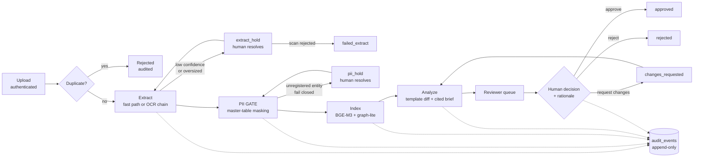

# AI Contract Review Co-Pilot

An AI-assisted workflow that helps in-house legal reviewers navigate, verify,
and approve/reject contracts — cutting review cycle time without ever taking
the decision out of human hands.

This repository is a **POC built for a C-level demo**: working functionality
first, architected for scale (10K → millions of documents) and shaped 1:1 to
an AWS production topology.

> **Synthetic data only.** The evaluation corpus is generated fake contracts
> with planted fake PII. No real contract text or real PII belongs in this
> repo or in any demo environment.

---

## Status

**All SDLC phases complete — gates G0–G7 passed** (reports in `docs/gates/`).

Measured on our own stack (sources in the gate reports):

| Metric | Value | Gate |
|---|---|---|
| Extraction fidelity — born-digital / scanned | 1.000 / 0.923 | G2 |
| PII recall in downstream text | 1.0000 (0 of 115 leaked) | G3 |
| Novel-PII documents halted (fail-closed) | 6/6 | G3 |
| Hybrid retrieval recall@10 | 1.000 (16 queries) | G4 |
| Known-issue detection | 0.923 (12/13) | G5 |
| Uncited AI findings shown to reviewers | 0 (by construction) | G5 |
| AI analysis latency (max) | 6.9 s in-container | G5/G7 |
| Auto-approvals in the audit trail | 0 (SQL-provable) | G6 |

Two presenter items remain before the session (not system defects): scale the
demo corpus to ~100 documents, and run two cold-start rehearsals of
`docs/demo_script.md`.

---

## Quick start

```bash
docker compose up -d --build          # Postgres+pgvector, MinIO, Presidio, API, worker
```

| Service | URL |
|---|---|
| API + React UI | http://localhost:8000 |
| API docs | http://localhost:8000/docs |
| Health check | http://localhost:8000/health |
| MinIO console | http://localhost:9001 (`minioadmin` / `minioadmin`) |
| Postgres | `localhost:5433` (5432 is left to a local Homebrew Postgres) |
| Presidio analyzer / anonymizer | `localhost:5002` / `localhost:5001` |

Migrations run automatically on backend boot (`alembic upgrade head` is the
container's entrypoint, and a failing migration fails the container).

Then seed — **one command does everything**:

```bash
cd backend && uv run python -m backend.seed_demo
```

`seed_demo` is idempotent and seeds all three things the system needs:
demo users, the **PII master table**, and the 22-contract synthetic corpus.

If you seed by hand instead, you need all three steps — the master table is
not optional. Without it every document halts in `pii_hold`, because the
master table is the only masking authority:

```bash
uv run python -m backend.seed_users                              # reviewer1, reviewer2, admin1
uv run python -m backend.pii.seed ../golden_set/master_table_seed.yaml
# …then upload contracts through the UI or POST /ingest/upload
```

Passwords come from `CRS_DEMO_PASSWORD` (default `demo1234` — POC only).

Log in at http://localhost:8000 and watch documents move through the pipeline.
Documents carrying *novel* PII deliberately halt in `pii_hold` for resolution
in the PII Admin screen — that is the designed behaviour, and the centrepiece
of the demo. The full walkthrough is `docs/demo_script.md`.

### Working on the code

```bash
# backend/
uv sync                                   # --extra ml for embeddings, --extra ocr for fallback OCR engines
uv run ruff check .                       # ruff, line-length 100, rules E/F/I/UP/B
uv run pytest -q                          # 81 unit tests (invariant tests skip without Postgres)
CRS_RUN_INVARIANT_TESTS=1 uv run pytest   # full suite; needs compose Postgres + migrations
uv run alembic upgrade head               # migrations 0001–0008

# frontend/
npm install && npm run dev                # Vite dev server on :5173 (CORS-allowed by the API)
npm run lint                              # oxlint
npm run build                             # tsc -b && vite build
```

Regenerate the synthetic corpus (deterministic, seeded — same output every
run; never hand-edit generated documents):

```bash
cd backend && uv run python ../golden_set/generator/generate.py
```

---

## Pipeline

```
upload → dedup/registry → extract → PII gate → index → analyze → human review
```



Everything left of the PII gate is raw-zone; everything right of it reads the
masked store only. **Full diagrams** — batched OCR chain, status state machine,
and deployment topology — are in [`docs/pipeline_flow.md`](docs/pipeline_flow.md).

| Stage | What happens |
|---|---|
| **Ingest** | Authenticated multi-file upload; content-hash dedup; document registry; job enqueued |
| **Extract** | Born-digital fast path; scanned PDFs go through the confidence-gated OCR chain (below) → clause segmentation |
| **PII gate** | Deterministic masking from the PII master table (fuzzy/OCR-tolerant); Presidio runs as a detector-only tripwire |
| **Index** | BGE-M3 embeddings, hybrid (vector + lexical) retrieval, Postgres graph-lite relations |
| **Analyze** | Template diff against canonical templates → STRONG model writes a brief over the deviations only (citations mandatory, ungrounded findings dropped); FAST model extracts key terms; prompt-injection heuristics |
| **Review** | Reviewer claims a contract and records a decision with a rationale |

Document statuses: `ingested → extracted → masked → indexed → analyzed →
in_review → approved | rejected | changes_requested`, plus the fail-closed
sidings `extract_hold`, `pii_hold`, `failed_extract`.

### OCR: confidence-gated engine chain

Scanned pages run through `CRS_OCR_ENGINE_CHAIN` (default
`tesseract,paddleocr,easyocr,docling`) behind one adapter interface
`ocr(page_image) → (text, confidence)`. A page scoring below
`CRS_OCR_CONFIDENCE_THRESHOLD` (0.80) is retried on the **next engine, that
page only**; the highest-confidence result wins. If every engine falls short,
the document parks in **`extract_hold`** — a human either accepts the
best-effort text with a rationale or rejects the scan. Every attempt is
audited; confidence is never fabricated.

Heavy engines live in the optional `ocr` extra; the default image ships
Tesseract only and the other adapters lazy-import, skipping with an audit
event when absent.

### Large documents

OCR runs in bounded batches of `CRS_OCR_BATCH_SIZE` (default 16) pages, so peak
memory is one batch rather than the whole document. Each completed batch is
checkpointed to the raw zone, letting a crashed job resume mid-document instead
of re-OCR'ing from page 1. Documents over `CRS_EXTRACT_MAX_PAGES` (default
1000) park in `extract_hold` with reason `oversized` for a human to route.

---

## Non-negotiable invariants

These are enforced in code and covered by `backend/tests/invariants/`:

1. **The PII gate is absolute.** Embedding, indexing, and the LLM read only the
   masked store. Raw text is never wired past the gate.
2. **Zero auto-approvals.** No code path transitions a contract to
   approved/rejected except the authenticated human-decision API, which
   requires a rationale. A failing pipeline job can never overwrite a terminal
   human decision.
3. **Everything is audited.** Every stage transition, AI suggestion, and human
   action appends to the append-only `audit_events` table. UPDATE/DELETE are
   never granted on it.
4. **No assumptions.** Deviations from the design document go to the product
   owner with evidence, and the outcome is recorded in the Decision Log in
   `CLAUDE.md`.

---

## API surface

| Route | Purpose |
|---|---|
| `GET /health` | Liveness + environment name; the compose healthcheck |
| `POST /auth/login` | JWT issue (roles: reviewer, admin; Cognito-shaped seam in `auth.py`) |
| `POST /ingest/upload` | Authenticated multi-file upload |
| `GET /extract/holds` · `POST /extract/holds/{id}/resolve` | Resolve OCR-confidence and oversized holds |
| `GET /pii/holds` · `POST /pii/holds/{id}/resolve` | Resolve novel-PII holds |
| `GET /pii/master` · `POST /pii/master` | PII master table admin |
| `GET /review/queue` · `GET /review/contracts/{id}` | Reviewer queue and detail |
| `POST /review/contracts/{id}/claim` | Claim for review |
| `POST /review/contracts/{id}/decision` | **The only path to a terminal decision** |
| `GET /review/contracts/{id}/audit` · `GET /review/metrics` | Audit trail and dashboard metrics |

Interactive docs at `/docs` when the stack is running. Every route except
`/health` and `/auth/login` requires a bearer token. Role gates:

| Role | Can reach |
|---|---|
| **reviewer** | all of `/extract/*`, `/review/claim`, `/review/decision` |
| **admin** | all of `/pii/*` — holds *and* master table |
| either | read-only review routes (`/queue`, contract detail, audit, metrics) and upload |

Roles are **strictly exclusive**, not hierarchical (`require_role` compares
for equality). An admin cannot approve a contract, and a reviewer cannot open
PII Admin — so a demo walkthrough that touches both needs two logins
(`reviewer1` and `admin1`).

Pull-based sources are not wired in the POC, but the seam exists: implement
`SourceConnector` (`ingestion/connectors.py`) with `poll() → fetch() → ack()`
and a runner hands bytes to the same `ingest_document()` the upload route
uses — zero changes to the ingestion core. See `/add-connector`.

---

## Configuration

All settings use the `CRS_` env prefix (`backend/src/backend/config.py`).
**`.env.example` is the full annotated reference** — every key with its
default, grouped by what you'd switch on (Cloudflare R2, Modal, OpenAI
embeddings, in-process pipeline). Copy it to `backend/.env` for local runs, or
use it as the checklist when filling in a hosting dashboard.

| Variable | Default | Notes |
|---|---|---|
| `CRS_DATABASE_URL` | local Postgres on 5433 | → Aurora PostgreSQL + pgvector |
| `CRS_S3_ENDPOINT_URL` / `CRS_S3_BUCKET_*` | MinIO, `raw`/`masked`/`audit` | → S3 + KMS |
| `CRS_S3_REGION` | `us-east-1` | MinIO ignores it; Cloudflare R2 needs `auto` |
| `CRS_PRESIDIO_*_URL` | local analyzer/anonymizer | detector-only tripwire |
| `CRS_EMBEDDING_PROVIDER` | `bge-m3` | design default (self-hosted); `openai` for hosts without torch, `hash` for tests |
| `CRS_EMBEDDING_MODEL` | provider default | `openai` → `text-embedding-3-small`, requested at 1024 dims |
| `CRS_EMBEDDING_API_KEY` / `CRS_EMBEDDING_BASE_URL` | unset | **config only — never hardcoded** |
| `CRS_INLINE_WORKER` | `0` | `1` runs the pipeline loop inside the API process (hosts with no worker tier) |
| `CRS_OCR_ENGINE_CHAIN` | `tesseract,paddleocr,easyocr,docling` | ordered cheapest-first |
| `CRS_OCR_CONFIDENCE_THRESHOLD` | `0.80` | below → next engine, then `extract_hold` |
| `CRS_OCR_BATCH_SIZE` | `16` | pages rasterized at once |
| `CRS_EXTRACT_MAX_PAGES` | `1000` | above → `extract_hold` reason `oversized` |
| `CRS_LLM_PROVIDER` | `anthropic` | `bedrock` for production; OpenAI-compatible: `openai`, `nvidia`, `mistral`, `minimax`, `kimi`, `qwen` |
| `CRS_LLM_MODEL_STRONG` / `CRS_LLM_MODEL_FAST` | provider default | tiered routing |
| `CRS_LLM_API_KEY` / `CRS_LLM_BASE_URL` | unset | **config only — never hardcoded** |
| `CRS_AWS_REGION` | `us-east-1` | bedrock provider only |
| `CRS_JWT_SECRET` | `dev-secret-change-me` | POC only; Cognito in production |
| `CRS_DEMO_PASSWORD` | `demo1234` | password for the seeded demo users; POC only |
| `CRS_STATIC_DIR` | unset | built React UI; set to `/app/static` in the image |
| `CRS_ENVIRONMENT` | `local` | reported by `/health`; compose sets `compose` |
| `CRS_RUN_INVARIANT_TESTS` | unset | set to `1` to run the invariant suite |

**LLM credentials.** Containers use the direct API with the read-only `ant`
profile mount. Host-side runs may point at the loopback proxy with
`CRS_LLM_BASE_URL=http://127.0.0.1:8787`. Do **not** set empty `ANTHROPIC_*`
env vars — empty-but-set shadows the profile and breaks auth.

---

## Evaluation

`golden_set/` holds 20–30 synthetic labeled contracts (see its README for the
label schema) generated by `golden_set/generator/generate.py`. Evals:

```bash
cd backend
uv run python -m backend.eval.extraction_eval    # G2
uv run python -m backend.eval.pii_eval           # G3
uv run python -m backend.eval.index_golden       # G4 (index the corpus first)
uv run python -m backend.eval.retrieval_eval     # G4
uv run python -m backend.eval.analysis_eval      # G5 — needs LLM credentials
```

---

## Implementation notes

Details that are easy to miss when reading the code for the first time:

| Area | Note |
|---|---|
| **Storage seam** | `storage.py` exposes two separate Protocols, `RawStorage` and `MaskedStorage`. The worker hands `index` and `analyze` **only** the masked handle — invariant #1 is enforced by the type seam, not by convention |
| **Job queue** | Postgres-backed (`jobs.py`, `SELECT … FOR UPDATE SKIP LOCKED`), claimed by stage. Maps to SQS in production. Run the worker once with `python -m backend.worker --once` to drain and exit |
| **Terminal guard** | `worker.py` skips any document already `approved`/`rejected` and writes a `stage.skipped_terminal` audit event — found by the Phase-7 LLM-down drill |
| **Chunking** | `MAX_CHUNK_CHARS = 4000`, split on clause sections |
| **Embeddings** | `BAAI/bge-m3`, normalized, loaded lazily; ~2.3 GB of weights download once into the `hfcache` volume. A deterministic hash embedder stands in for tests |
| **Retrieval** | Dense (pgvector cosine) + sparse (Postgres `ts_rank` / `websearch_to_tsquery`) fused with Reciprocal Rank Fusion, `RRF_K = 60`. `retrieval_eval --rerank` evaluates the optional reranker |
| **Template diff** | `FAMILY_MIN_SCORE = 0.5` to claim a family, `DEVIATION_THRESHOLD = 0.70`, `STANDARD_THRESHOLD = 0.85`, heading match fuzzed at `0.8` for OCR tolerance |
| **Groundedness** | Findings whose `citation` is not a real chunk id are **dropped before display**, never shown and never repaired. Prompts are versioned (`PROMPT_VERSION`) |
| **Injection defence** | Contract text is data, never instruction: `_INJECTION_PATTERNS` in `analysis/service.py` raises a cited high-severity finding rather than acting on the text |
| **PII tripwire** | Presidio findings below `_PRESIDIO_MIN_SCORE = 0.5` are ignored, matches already inside a `[TYPE-N]` placeholder are skipped, and local regex recognizers run alongside Presidio |
| **PII tables** | `pii_known_entities` (the master table), `pii_entity_map` (per-document placeholder → original, tagged `registered` or `tripwire-added`), `pii_holds` |
| **Auth** | pbkdf2-sha256 at 200k iterations, HS256 JWT, 12-hour TTL. `get_actor` is the single dependency every route imports, so the Cognito swap touches one module |

## Testing & CI

```
backend/tests/                 81 unit tests — extraction, OCR chain, large docs,
                               PII masker/tripwire/gate, knowledge, analysis,
                               ingestion, upload + review APIs, worker, connectors
backend/tests/invariants/      security invariants; require the compose Postgres
                               and only run with CRS_RUN_INVARIANT_TESTS=1
```

`.github/workflows/ci.yml` runs on every PR and on pushes to `main`: ruff →
`alembic upgrade head` → the **full** suite including invariants against a
`pgvector/pgvector:pg16` service container, plus a Node 22 frontend build.

## Container image

`backend/Dockerfile` is multi-stage and built from the **repo root** as context:
a Node 22 stage builds the React SPA into `/app/static`, the Python stage
installs `.[ml]`, apt-installs `tesseract-ocr`, and copies `golden_set/` in so
`seed_demo` works inside the container. The entrypoint runs migrations and
then uvicorn. The `worker` service reuses the same image with
`python -m backend.worker`.

## Layout

```
backend/src/backend/
  api/          route modules — auth_routes, ingest, extract, pii, review
  ingestion/    connectors.py (SourceConnector interface), core.py (dedup + registry)
  extraction/   classifier, fast_path, ocr_engines, ocr_path, segmenter, service
  pii/          masker (the only masking component), tripwire, seed, models, service
  knowledge/    chunker, embedder, retrieval (RRF), graph, service
  analysis/     template_diff, prompts, reference_templates, service
  llm/          base.py (client protocol) + providers.py (multi-provider adapter)
  eval/         golden-set evaluations, one per gate
  auth.py · audit.py · jobs.py · worker.py · storage.py · db.py · models.py · config.py
backend/alembic/versions/   0001 audit_events → 0008 extract_hold_reason
frontend/src/pages/         Login, Dashboard, Queue, Contract, Upload, PiiAdmin
golden_set/                 synthetic corpus, generator/, master_table_seed.yaml
docs/                       design doc, SDLC plan, gate reports, demo script, deploy guides
.claude/skills/             project skills — pipeline-stage, add-connector,
                            security-gate, demo-prep, unit-tests, self-evaluate
scripts/ec2-user-data.sh    EC2 bootstrap
docker-compose.yml          the single environment definition
```

`main.py` at the repo root is a scratch file, not part of the system.
`frontend/README.md` is still the stock Vite template.

---

## Documentation

Read in this order:

1. `docs/03_design_document.md` — **the** authoritative design: architecture,
   data model, invariants, feasibility, open questions.
2. `docs/02_sdlc_plan.md` — phase plan G0–G7 with gates.
3. `docs/01_brainstorm_and_improvements.md` — rationale for deviations from the
   original security review.
4. `project_document/AI_Contract_CoPilot_Security_Review.txt` — original
   security architecture (the production north star). **Not in the
   repository** — `project_document/` is gitignored, so this one is
   distributed out of band.
5. `CLAUDE.md` — working agreements, the confirmed Decision Log, and agent
   guidance.
6. `docs/pipeline_flow.md` — process-flow diagrams for the whole system.

Deployment guides: `docs/deploy_aws_ec2.md`, `docs/deploy_render.md`, and
`docs/deploy_vercel_render.md` (free-tier: Vercel + Render + Cloudflare R2 +
Modal). All are synthetic-data-only demo environments.

---

## Production roadmap

Carried forward from the gate reports: real secrets management (dev JWT secret
and demo passwords → Secrets Manager), restricted-schema grants on the PII
tables, PaddleOCR/EasyOCR adapter validation and Docling per-page confidence
under `--extra ocr`, the Bedrock provider flip (`CRS_LLM_PROVIDER=bedrock`),
DMS and shared-filesystem connectors, and re-validation of every metric against
a real contract corpus.
