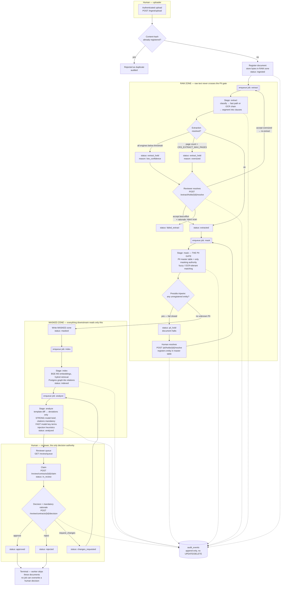
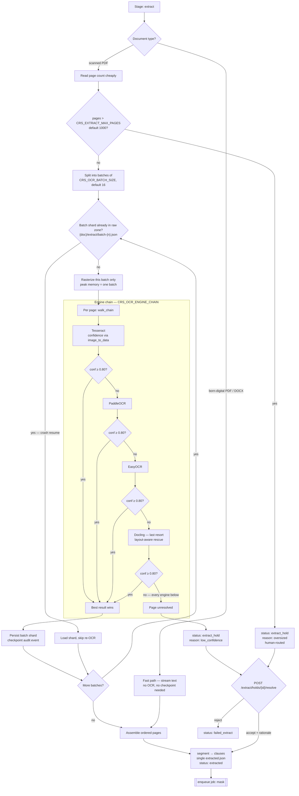
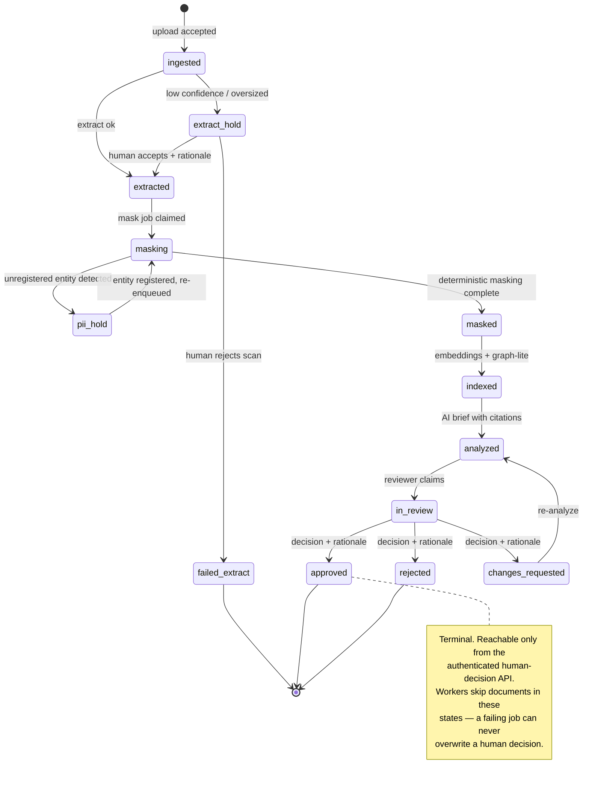
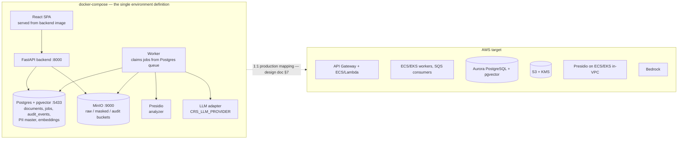

# Process Flow — end to end

Diagrams of the contract lifecycle as it is actually wired in code. Stage
chaining is by job enqueue (`backend/src/backend/jobs.py`); handlers are
registered in `backend/src/backend/worker.py`.

Source of truth for each edge:

| Edge | Code |
|---|---|
| upload → `extract` | `ingestion/core.py:76` |
| extract → `mask` | `extraction/service.py:222` |
| mask → `index` | `pii/service.py:121` |
| index → `analyze` | `knowledge/service.py:69` |
| extract-hold resolve → `extract` / `mask` | `api/extract.py:137`, `api/extract.py:159` |
| pii-hold resolve → `mask` | `api/pii.py:122` |
| `changes_requested` → `analyze` | `api/review.py:214` |

---

## 1. End-to-end pipeline

**Two structural guarantees visible above:** nothing leaves the raw zone
except through the mask stage, and no arrow reaches `approved`/`rejected`
except from the human decision endpoint.

---

## 2. Extraction detail — confidence-gated OCR chain, batched

Engines whose library is not installed are skipped with an audit event — the
default image ships Tesseract only; the rest are the optional `ocr` extra.
Confidence is never fabricated: an engine that cannot report per-page
confidence reports unavailable instead.

---

## 3. Document status state machine

---

## 4. Deployment topology — local, and its AWS shape

